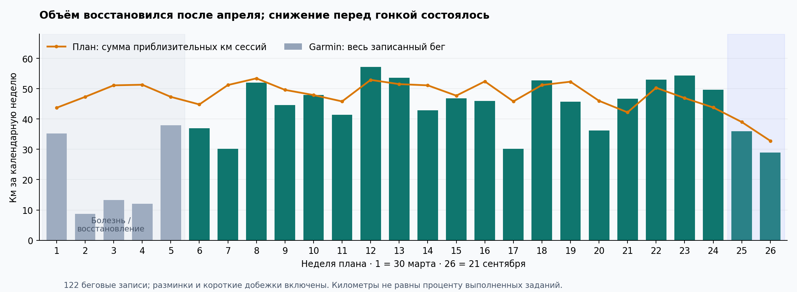
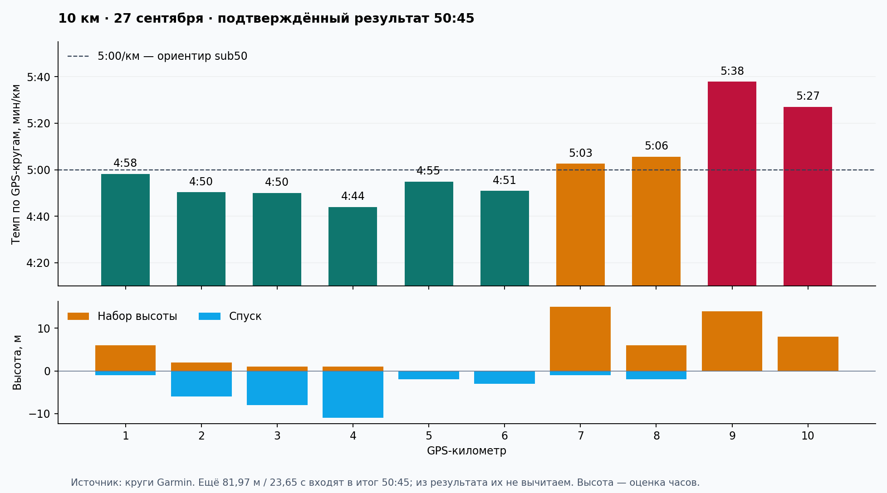

# Подготовка к 10 км: что сработало и что изменить

**Цикл: 30 марта — 27 сентября 2026 · отчёт от 28 сентября 2026**  
**Цель: sub50 · подтверждённый тобой результат: 50:45 · трасса с двумя прохождениями моста.**

## Главный вывод

Подготовка в целом соответствовала задаче и позволила приблизиться к sub50. После болезней и восстановления в апреле ты вернулся к регулярному бегу, выдерживал длинные по 80–100 минут, выполнял большинство разобранных интервальных заданий и вышел на контрольные 5 км около 23:20–23:40. Это делает цель sub50 обоснованной, но не означает, что она была гарантирована на любой трассе.

Главный резерв следующего цикла — **лучше управлять распределением усилий и переносить имеющуюся скорость на последние километры 10 км**. Данных в пользу необходимости просто добавить ещё быстрых интервалов меньше, чем данных в пользу более лёгких промежуточных дней, согласованных пульсовых ориентиров, настоящих разгрузок и подготовки к профилю конкретного старта.

Результат на 45 секунд выше цели — на 1,5% относительно 50:00. Гонка не выглядит доказательством «неподходящего плана»: во второй половине действительно больше подъёма, а позднее замедление совпадает со снижением мощности и частоты шага. Однако все 45 секунд нельзя уверенно списать на мост, как нельзя и точно вычислить результат на равнине.

## Что проверено и насколько можно доверять выводам

Источник плана — [таблица «Тренировки», лист с gid 222468947](https://docs.google.com/spreadsheets/d/1ZVl1OziuG2aKve1ROAi83_JzwufVX2H3pon2NuqD9zw/edit?gid=222468947). Прочитаны все 130 строк занятий. Garmin просмотрен за весь период с завершённой пагинацией: **167 активностей, из них 122 беговые записи в 108 разных дней**. Других категорий бега в выгрузке нет. Дополнительно присутствуют 42 дыхательные практики, два плавания и одна прогулка. Отсутствие записанной ОФП не доказывает, что её не было.

Весь журнал использован для объёма и регулярности. Подробно по кругам разобраны **25 ключевых записей**, включая две части одного занятия 9 сентября: интервалы, темповые, горки, три длинные и финальная гонка. Разбор выборочный и не устанавливает точную долю времени во всех пульсовых зонах за полгода. Запросы к Garmin выполнялись последовательно; три агента Luna medium анализировали уже сохранённые данные.

Запись часов не равна одному занятию: отдельно записанные разминки, заминки и короткие вечерние добежки входят в километраж, но не считаются дополнительными качественными тренировками. План сравнивается с его **текущей версией**, а не с исторической редакцией на каждую дату: часть расхождений могла быть сознательной корректировкой. Совпадение структуры и сдвиг даты на день учитываются как вероятный перенос, например 4×7 минут 24 → 25 июня.

Темп рабочего блока рассчитан из его времени и дистанции. Соседние ACTIVE-круги объединены до восстановления, чтобы автокруг 1 км не раздробил один повтор на несколько. ЧСС блока взвешена по времени кругов. Это достаточно для проверки задания, но не для определения индивидуальных физиологических порогов. Погода, рельеф, состояние после болезни и погрешности часов ограничивают сравнение разных дней.

## Объём и регулярность

За весь цикл записано **1 040,1 км и около 110 ч 22 мин бега**. Сумма приблизительных дистанций занятий в таблице — 1 239,3 км. Отношение 83,9% описывает километраж, а не «процент выполненного плана»: в него одновременно входят апрельские пробелы, дополнительные добежки и различия разминок.

После первых пяти недель, с 4 мая до финиша, записано **932,9 км против 998,6 км плана**, то есть 93,4% его приблизительного объёма; в среднем 44,4 км и 4,6 бегового дня в неделю, включая разгрузки и тейпер. Недельный объём доходил до 57,2 км. Это уже устойчивый цикл, а не продолжение апрельской прерывистости.

Для расчёта плана сложены `approx_km` отдельных занятий. Повторяющаяся колонка `week_km_est` не суммировалась: на первой неделе она даёт 45 км, тогда как строки дают 43,7 км. Эта небольшая несогласованность таблицы не влияет на выводы.

## Что происходило в апреле

За календарный апрель найдены **9 пробежек, 78,35 км** при 21 запланированном занятии и приблизительно 204,3 км. Твоё воспоминание «то болел, то восстанавливался» согласуется с прерывистой записью. Это описание журнала, не восстановленный календарь болезни.

| Дата | Бег | Длительность | Что видно |
|---|---:|---:|---|
| 01.04 | 7,01 км | 45:42 | Лёгкий бег с ускорениями по названию |
| 03.04 | 8,14 км | 50:05 | Аэробный бег |
| 05.04 | 12,01 км | 81:05 | Длинный |
| 06.04 | 8,69 км | 65:53 | Восстановительный |
| 18.04 | 5,05 км | 37:52 | Первая следующая запись после 6 апреля |
| 19.04 | 8,29 км | 60:06 | Короче плановых 90 минут |
| 26.04 | 12,05 км | 90:01 | Первая следующая запись после 19 апреля |
| 27.04 | 8,22 км | 65:01 | Восстановительный |
| 29.04 | 8,90 км | 59:17 | Все 6×3 минуты записаны |

Беговых записей нет **7–17 апреля** и **20–25 апреля**. На 11 апреля есть прогулка, на 28 апреля — плавание; недостающий бег не обнаружен среди других видов активности. Если были занятия без часов или несинхронизированные записи, они здесь не учтены.

Следствие для оценки плана: апрельская «база + горки» не подтверждена как выполненный блок. Уже 29 апреля возобновлены 6×3 минуты, а 2 мая — контроль. Нельзя утверждать, что такое возвращение навредило: последующий цикл состоялся. Но в будущем после подобного провала регулярности разумнее пересматривать ближайший блок по фактическому восстановлению, чем автоматически переходить к очередной календарной фазе.

## Оценка фаз

Здесь соседние фазы объединены по смыслу, а разгрузочные недели сохранены внутри соответствующего периода. Оценка «подходит» означает практическую пригодность по имеющимся данным, а не доказанный причинный вклад каждой тренировки в результат.

| Период | План / факт, км | Что получилось | Что ограничило эффект или осталось неясным |
|---|---:|---|---|
| Недели 1–2, вход после болезни, 30.03–12.04 | 91,0 / 43,9 | В начале записаны аэробные занятия и длинный 80 минут | Регулярность прервалась. Фазу нельзя считать завершённой только по календарю |
| Недели 3–5, база, горки и первый контроль, 13.04–03.05 | 149,7 / 63,3 | В конце возвращаются 65 минут легко, 6×3 минуты и длинный | Основной горочный блок в апреле не подтверждается; контроль 2 мая содержит лишь 4,10 км ACTIVE |
| Неделя 6, разгрузка, 04–10.05 | 44,8 / 37,0 | Есть 60 минут восстановительно, 45 минут аэробно и 80 минут длинного | Субботняя основная запись имеет среднюю ЧСС 162; назвать всю неделю лёгкой по ярлыку нельзя |
| Недели 7–10, порог и контроль, 11.05–07.06 | 202,1 / 174,8 | Выполнены 4×6, 5×5 и 3×10 минут; к концу мая есть 5 км за 23:44 | Темп вырос вместе с ЧСС. Несколько рабочих блоков заметно выше заданных диапазонов; лёгкие субботы часто интенсивнее замысла |
| Неделя 11, разгрузка, 08–14.06 | 45,8 / 41,4 | Общий объём немного ниже предыдущей недели | 13 июня записаны около 5 км за 25:19, ЧСС 171, и дополнительная часть; воскресный длинный — ЧСС 153. Снижение км не гарантирует разгрузку по усилию |
| Недели 12–14, переход к 10 км, 15.06–05.07 | 155,5 / 153,6 | 5×1 км выполнены ровно, 25 минут темпа и 4×7 минут выдержаны, длинный достигает 100 минут | 25–28 июня получилась плотная связка: темп, горки, субботний бег с ЧСС 160, длинный с ЧСС 152. Восстановительных промежутков мало |
| Недели 15–20, специфика, включая разгрузку №17, 06.07–16.08 | 295,4 / 257,5 | Выполнены 5×1 км, почти весь объём 3×1600 м и ровные 6×800 м; контрольные 5 км около 23:40 | Некоторые занятия отсутствуют, а контрольные 5 км почти не меняются между июлем и августом. Это не доказывает плато физиологии: условия и дистанции неодинаковы |
| Неделя 21, разгрузка, 17–23.08 | 42,2 / 46,7 | 3×1 км сокращают объём интенсивной работы | Общий объём выше плана. В пятницу 68 минут вместо 38; по объёму неделя не получилась разгрузочной относительно предшествующей |
| Недели 22–24, sharpening и контроль, 24.08–13.09 | 141,0 / 157,0 | Выполнены 3×2 км; 12 сентября около 5 км за 23:18 | Фактический объём выше плана на 11,3%. 9 сентября 4×800 прерваны; 11 сентября лёгкая активация 57:41 вместо 35 минут |
| Недели 25–26, тейпер и старт, 14–27.09 | 71,8 / 65,0 | Объём снижен, 3×1 км и 2×6 минут выполнены, получен финиш 50:45 | Ощущения свежести не зафиксированы. Итоговый результат не позволяет отдельно оценить эффект тейпера |

## Подходят ли отдельные виды тренировок

**Лёгкий и восстановительный бег — оставить как основу.** В именованных `r_`/`e_` занятиях много примеров средней ЧСС 130–140. Есть описательный признак улучшения: [27 апреля](https://connect.garmin.com/modern/activity/22673299874) — 8,22 км за 65 минут при ЧСС 135; [14 сентября](https://connect.garmin.com/modern/activity/24353117780) — 8,29 км за 55:26 при ЧСС 134. При похожем пульсе скорость стала выше. Но апрель был восстановлением после болезни, а маршруты и погода различались: это не чистое измерение тренировочного эффекта.

**Длинные 80–100 минут — разумно сохранить: такой объём работы подтверждён записями.** Например, [24 мая](https://connect.garmin.com/modern/activity/22991698165) — 15,59 км за 100 минут; [21 июня](https://connect.garmin.com/modern/activity/23323854910) — 16,73 км за 100 минут; [6 сентября](https://connect.garmin.com/modern/activity/24256389934) — 12,71 км за 80 минут. Данных, что для ближайшего sub50 прежде всего нужен ещё более длинный long run, нет. Важнее сохранить его аэробный характер: у майского длинного рабочие километры в основном с ЧСС 148–157, тогда как 6 сентября большая часть кругов была около 140–148 при более холмистом маршруте. Эти наблюдения не заменяют проверку актуальной границы лёгкой интенсивности.

**Пороговые блоки — формат можно сохранить, управление интенсивностью требует пересмотра.** [13 мая, 4×6 минут](https://connect.garmin.com/modern/activity/22862930040): средний рабочий темп около 5:50/км, ЧСС повторов 151–160. [20 мая, 5×5](https://connect.garmin.com/modern/activity/22943806191): около 5:17/км, ЧСС 158–168. [27 мая, 3×10](https://connect.garmin.com/modern/activity/23027340245): примерно тот же 5:17/км уже на 30 мин работы, ЧСС 162–166. Увеличение выдержанного рабочего времени — сильная сторона. Но из этого нельзя получить «улучшение порога на 33 с/км»: усилие тоже повысилось, а заданные диапазоны составляли 152–158 или 153–160.

На [25 мин темпа 19 июня](https://connect.garmin.com/modern/activity/23302978380) средняя ЧСС рабочей части около 167 против цели 150–158. На [20 мин 28 августа](https://connect.garmin.com/modern/activity/24144464644) она около 163 против 150–156. Это устойчивое расхождение с текущей таблицей. Возможны как слишком интенсивное выполнение, так и устаревшие ориентиры или сознательная перенастройка; названия поздних занятий уже содержат `160hr`. Для нового плана нужно согласовать, что означает «контролируемый темп», по актуальным наблюдениям и ощущению, а не переносить старые цифры автоматически.

**Интервалы 800–2000 м — выглядят уместными; скорость на отрезках поддерживает осмысленную попытку sub50.** [17 июня, 5×1 км](https://connect.garmin.com/modern/activity/23278920324): 4:47, 4:52, 4:46, 4:44, 4:42. [5 августа, 6×800](https://connect.garmin.com/modern/activity/23857778590): темп повторов около 4:33–4:40/км. Сессии выполнены без позднего развала темпа. Это аргумент в пользу достаточной скорости на отрезках; он не доказывает устойчивость на непрерывных 10 км.

Самая полезная специфическая проверка — [26 августа, 3×2 км](https://connect.garmin.com/modern/activity/24118917080): **9:35, 9:34 и 9:53**, то есть 4:47, 4:47 и 4:56/км. Все 6 км работы выполнены. Третий блок медленнее, а средняя ЧСС блоков примерно 166 → 174 → 178. Погодная станция на Косе сообщала 25°C и влажность 79%; это существенный контекст, а не доказанная причина роста пульса. Работа быстрее целевых 5:00/км поддерживает реалистичность цели, но сама по себе не гарантирует sub50. Требовать для подтверждения ещё и максимальную контрольную десятку перед стартом из этого не следует.

**Горки — полезный дополнительный формат, эффект всего блока не установлен.** [15 мая](https://connect.garmin.com/modern/activity/22885799246) выполнены 8×10 секунд; [26 июня](https://connect.garmin.com/modern/activity/23382415557) — все 12×45 секунд с расстояниями примерно 186–200 м. Короткие ускорения и длинные силовые отрезки дают разный стресс. Вторые должны входить в учёт качественных дней, особенно рядом с темпом. Апрельский блок горок нельзя оценить как успешно пройденный; также нет оснований строить следующий цикл ради исправления одного ярлыка Garmin «anaerobic shortage».

**Parkrun подходит либо как лёгкий день, либо как контроль — роль нужно заранее выбирать.** Основная проблема не в самом parkrun, а в фактическом усилении дня после пятничной работы. [30 мая](https://connect.garmin.com/modern/activity/23063652911) при плане лёгкой субботы записано около 5 км за 23:44, ЧСС около 179; [13 июня](https://connect.garmin.com/modern/activity/23229875453), тоже планово лёгкая суббота, — около 5 км за 25:19, ЧСС 171. Это гораздо убедительнее говорит о дополнительной нагрузке, чем одно слово `easy` в названии плана. В таком случае быстрый parkrun следует учитывать как качественную тренировку и соответственно облегчать соседние дни.

## Контрольные 5 км: что можно сказать о прогрессе

| Дата | Время записи | GPS-дистанция | Контекст |
|---|---:|---:|---|
| 02.05 | Рабочая часть 23:14 | 4,100 км ACTIVE | Не полный контроль 5 км; исключён из сравнения результатов |
| 30.05 | 23:44 | 4,999 км | Быстро в день, запланированный лёгким |
| 06.06 | 24:14 | 5,021 км | Плановый контроль №2 |
| 13.06 | 25:19 | 5,079 км | Быстрый бег в планово лёгкую субботу |
| 11.07 | 23:40 | 5,031 км | Плановый контроль №3 |
| 15.08 | 23:39 | 5,046 км | Плановый контроль №4 |
| 12.09 | 23:18 | 4,998 км | Плановый контроль №5 |

Это времена записей, а не независимо проверенные официальные результаты всех parkrun. GPS-дистанции не нормализованы до ровно 5 км. С мая до сентября лучшие сопоставимые по длине записи улучшились на 26 секунд, примерно 1,8%; июль–август почти одинаковы, в сентябре быстрее. Раннего полноценного 5-км теста до начала цикла нет, поэтому масштаб общего прогресса после болезни оценить по гонкам нельзя.

## Финальные 10 км

[Запись гонки Garmin](https://connect.garmin.com/modern/activity/24514214454): 10,08197 км за 50:45,13. Ты подтвердил результат 50:45. Для соревновательной дистанции 10 км это **5:04,5/км**; GPS-средний темп получается около 5:02/км. Разница — особенность измеренной дистанции. Последние 81,97 м заняли 23,65 с и входят в результат: их нельзя вычитать, чтобы «улучшить» время на 10 км.

| Отрезок по GPS | Время | Средний темп | Набор / спуск | Средняя ЧСС |
|---|---:|---:|---:|---:|
| Км 1–5 | 24:17 | 4:51/км | +10 / −28 м | 173 |
| Км 6–10 | 26:04 | 5:13/км | +43 / −6 м | 182 |
| Км 7–8 | 10:08 | 5:04/км | +21 / −3 м | 183 |
| Км 9–10 | 11:05 | 5:32/км | +22 / −0 м | 181 |

Последние две строки — детализация второй половины; прибавлять их к первым двум нельзя. Высота — оценка часов, без независимой сверки профиля трассы.

**Рельеф действительно влияет на интерпретацию.** Первая половина преимущественно вниз, вторая вверх; вторая GPS-пятёрка медленнее на 1:47. По кругам нельзя точно привязать каждый участок к мосту, но запись согласуется с твоим описанием тяжёлой второй части.

**План осторожного старта не воспроизведён буквально.** Для цели 5:00/км таблица предлагала первые два км на 3–5 секунд медленнее, а фактически вышло 4:58 и 4:50, затем 4:50 и 4:44. Однако спуск частично объясняет быстрый темп. Поэтому «ты точно перегорел на старте» — слишком сильный вывод. Практический вопрос следующего старта: насколько стартовое усилие оставляет запас для поздних подъёмов, даже если текущий темп на спуске кажется лёгким.

**На 9–10-м км замедлился не только темп.** По сравнению с первыми шестью километрами средняя мощность снизилась примерно с 420 до 388 Вт, частота шага — со 178 до 172 шагов/мин; ЧСС после 183 на 7–8-м км составила 181 и 180. Это совместимо с нарастающей усталостью и трудностью удерживать усилие на подъёме. Это не доказательство конкретного мышечного ограничения, нехватки «порога», питания или перетренированности. Мощность часов также является оценкой, а не лабораторным измерением.

Погодные данные станции за два часа до старта: 9,4°C, туман, влажность 97%. Это не точная погода вдоль трассы, но оснований списывать гонку на летнюю жару в этих данных нет.

## Разгрузка и подводка

Три недели перед тейпером, №22–24, дали **53,0 → 54,3 → 49,7 км**, в среднем 52,3 км/нед. Это больше текущего плана — особенно на неделях 23–24. Часть прибавки создают короткие отдельные добежки, но есть и удлинения основных занятий: 21 августа 68 вместо 38 минут, 5 сентября около 70 вместо 50, 11 сентября почти 58 вместо 35.

Затем снижение объёма состоялось: неделя №25 — **36,0 км** (примерно −31% относительно среднего №22–24), гоночная — **29,0 км вместе с гонкой и её разминкой**. До дня старта за понедельник–субботу было 17,4 км. Последнее число относится к шести дням и не является сопоставимым недельным процентом снижения.

Короткие специфические занятия сохранены: [16 сентября, 3×1 км](https://connect.garmin.com/modern/activity/24380171037) — 5:00, 4:53, 4:56; [23 сентября, 2×6 минут](https://connect.garmin.com/modern/activity/24467245009) — около 4:59/км. Это согласуется с задачей сохранить ритм при меньшем объёме. Отсутствие пятничных записей 18 и 25 сентября снизило объём дополнительно; без твоих ощущений это нельзя оценить как ошибку или причину результата.

Есть отдельная незавершённая сессия [9 сентября](https://connect.garmin.com/modern/activity/24293408130): в задании 4×800 записаны первый отрезок 800 м за 3:52 и лишь 278 м второго. Следующие [4,84 км лёгкого бега](https://connect.garmin.com/modern/activity/24293647259) не являются продолжением оставшихся интервалов. Причина неизвестна. Одного такого эпизода недостаточно, чтобы назвать весь блок непереносимым, особенно с последующим сильным 5-км контролем 12 сентября.

## Что перенести в следующий план

1. **Сохранить основу, а не начинать с нуля:** регулярные 4–5 беговых дней, лёгкие пробежки, длинный порядка 80–100 минут и уже знакомые интервальные форматы. Фактические 45–50 км многих недель — более подходящая отправная информация, чем номинальные цифры неполного апреля. Это диапазон наблюдавшейся нагрузки, не обязательная новая норма.
2. **Планировать интенсивную нагрузку с учётом субботы.** Если parkrun быстрый, считать его качественным днём и пересматривать пятничный темп. Не оставлять в отчёте «лёгкую субботу» только потому, что так называлась строка. После длинного сохранять возможность укоротить восстановительный бег при тяжёлых ногах, как и предлагал исходный план.
3. **Проверить и согласовать ориентиры интенсивности.** Старые 150–158 для темпа многократно расходятся с фактом; не стоит ни автоматически повышать все границы, ни считать всякий выход выше нарушением. Нужны одинаково понимаемые ЧСС, ощущение усилия и контрольное занятие в сопоставимых условиях. В дневнике полезны короткие оценки «контролируемо / на пределе» и восстановление на следующий день.
4. **Развивать устойчивость целевого усилия, не только скорость.** 6×800 по 4:35 уже получаются. Для следующего цикла имеет смысл сохранять постепенно дозируемые длинные блоки около реалистичного 10-км усилия и контролировать последний повтор: темп, ЧСС, рельеф и запас. Не превращать каждую специфическую тренировку в попытку доказать 4:45/км, если соревновательная задача ближе к 5:00.
5. **Учитывать профиль будущей гонки.** Для старта с поздними мостами полезна отдельная подготовка к контролируемому усилию на подъёме и возвращению в ритм после него, а также план прохождения спусков без чрезмерной траты сил. Выбрать точную дозировку следует уже при составлении следующего цикла; из текущей гонки не следует необходимость добавлять тяжёлые горки каждую неделю.
6. **Разгружать фактический объём и тяжёлые дни.** Названия «делод» недостаточно: неделя №21 оказалась объёмнее предшествующей, а №11 включала быстрый субботний бег. Тейпер в конце цикла был реальным; менять его радикально только из-за недостающих 45 секунд оснований нет.
7. **После болезни пересматривать календарь.** Апрельская фаза не была полностью пройдена, хотя названия последующих недель продолжились. В новом плане переход к следующему блоку лучше привязывать к восстановленной регулярности и переносимости, а не только к номеру недели.

Эти приоритеты — выводы из твоего журнала. Общий принцип сочетать большой объём действительно лёгкой работы с дозированной интенсивной поддерживается исследованием любителей-бегунов [Muñoz et al., 2014](https://pubmed.ncbi.nlm.nih.gov/23752040/): обе сравниваемые программы улучшили 10-км результат; преимущество одной в основном межгрупповом сравнении не было статистически значимым. Поэтому здесь нет требования универсального «80/20» и нет расчёта твоего распределения зон из средних пульсов.

Уменьшение объёма при сохранении отдельных интенсивных стимулов согласуется с [метаанализом тейпера Wang et al., 2023](https://pubmed.ncbi.nlm.nih.gov/37163550/). Его групповые результаты не задают обязательный точный процент для твоего следующего старта и не позволяют ретроспективно объявить нынешний тейпер неудачным.

## Ограничения, важные для дальнейшего планирования

Нет полного дневника субъективной усталости, боли, сна, причин переносов и точных дат болезни. Историю индивидуальных зон и лабораторные пороги не проверяли. По выборке нельзя поставить диагноз, доказать перетренированность, причинно приписать результат определённой фазе или рассчитать точное время «без моста». Факт выполнения заданий и сопоставление с текущей таблицей надёжнее, чем объяснение того, почему произошло отклонение.

Самый надёжный ориентир для следующего цикла — сочетание трёх фактов: **устойчивый объём после апреля; выполненная скорость на отрезках и 5 км; потеря темпа и мощности на поздних подъёмах итоговой десятки**. Новый план должен учитывать все три, а не только финишные 50:45.

## Приложения

- [Ключевые тренировки: 25 подробных разборов и рабочие блоки](key_workouts.md).
- [Снимок исходных данных и расчётов для последующего планирования](training_evidence.json): текущий план, 122 беговые записи, 25 наборов кругов, недельные агрегаты, погодный контекст и ограничения метода.
- Недельная таблица ниже позволяет проверить объём независимо от общего заключения.

| Неделя / начало | План, км | Garmin, км | Garmin, мин | Беговые дни |
|---|---:|---:|---:|---:|
| 1 · 2026-03-30 | 43,7 | 35,2 | 237 | 4 |
| 2 · 2026-04-06 | 47,3 | 8,7 | 66 | 1 |
| 3 · 2026-04-13 | 51,1 | 13,3 | 98 | 2 |
| 4 · 2026-04-20 | 51,3 | 12,1 | 90 | 1 |
| 5 · 2026-04-27 | 47,3 | 38,0 | 266 | 4 |
| 6 · 2026-05-04 | 44,8 | 37,0 | 248 | 4 |
| 7 · 2026-05-11 | 51,2 | 30,2 | 220 | 4 |
| 8 · 2026-05-18 | 53,4 | 52,0 | 321 | 5 |
| 9 · 2026-05-25 | 49,6 | 44,6 | 279 | 4 |
| 10 · 2026-06-01 | 47,9 | 48,0 | 301 | 5 |
| 11 · 2026-06-08 | 45,8 | 41,4 | 249 | 4 |
| 12 · 2026-06-15 | 52,9 | 57,2 | 342 | 5 |
| 13 · 2026-06-22 | 51,5 | 53,6 | 329 | 5 |
| 14 · 2026-06-29 | 51,1 | 42,8 | 251 | 4 |
| 15 · 2026-07-06 | 47,7 | 46,8 | 283 | 5 |
| 16 · 2026-07-13 | 52,4 | 45,9 | 292 | 4 |
| 17 · 2026-07-20 | 45,8 | 30,1 | 196 | 3 |
| 18 · 2026-07-27 | 51,2 | 52,7 | 325 | 5 |
| 19 · 2026-08-03 | 52,3 | 45,7 | 271 | 4 |
| 20 · 2026-08-10 | 46,0 | 36,2 | 234 | 4 |
| 21 · 2026-08-17 | 42,2 | 46,7 | 308 | 6 |
| 22 · 2026-08-24 | 50,3 | 53,0 | 328 | 5 |
| 23 · 2026-08-31 | 46,9 | 54,3 | 355 | 5 |
| 24 · 2026-09-07 | 43,8 | 49,7 | 325 | 7 |
| 25 · 2026-09-14 | 39,0 | 36,0 | 228 | 4 |
| 26 · 2026-09-21 | 32,8 | 29,0 | 180 | 4 |
