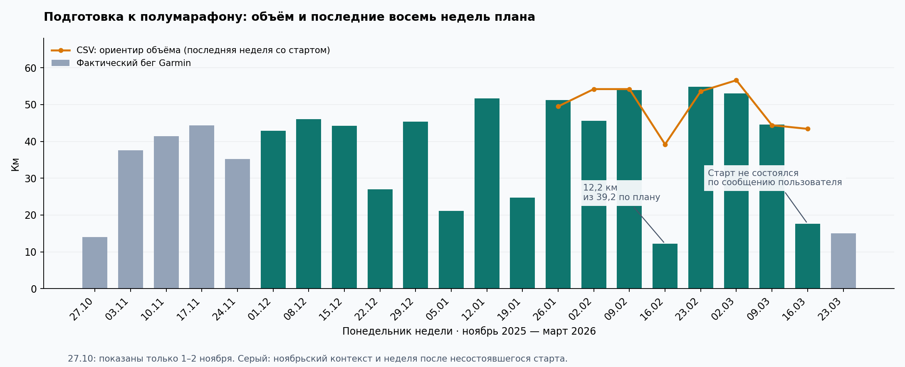
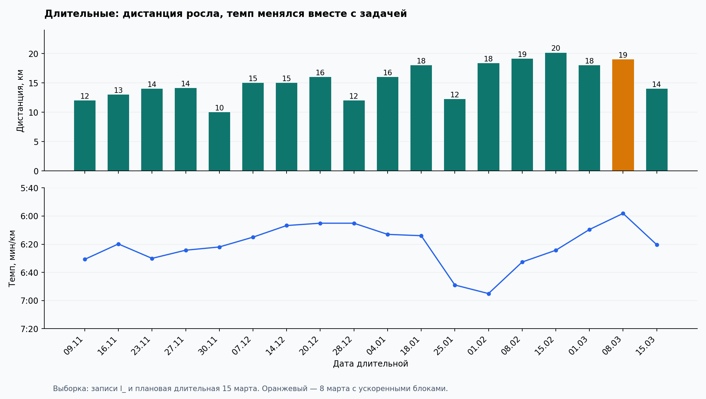

# Подготовка к полумарафону 22 марта 2026 года

**Основной период: 1 декабря 2025 — 22 марта 2026.** Ноябрь рассмотрен как предыстория, 23–29 марта — отдельно как переход к следующему циклу. Отчёт составлен 29 сентября 2026 года.

## Что удалось сделать

За 16 недель основного цикла Garmin зарегистрировал **636,2 км и 67 часов бега за 67 беговых дней**. Длительные выросли до 18–20 км: шесть записей достигли как минимум 18 км. Интервальная работа постепенно удлинилась от 600–800 м до 1200–1600 м. В начале марта состоялась специфическая длительная: **19 км с двумя блоками по 4 км примерно по 5:40 и 5:43/км**, без заметного ухудшения второго блока по темпу и средней ЧСС.

Это подтверждает большой объём выполненной подготовки и опыт длительного бега. **Проверки этой подготовки полумарафоном не произошло:** по твоему сообщению, перед стартом ты заболел. Поэтому отчёт не приписывает тебе гипотетический результат и не объявляет цикл неудачным из-за отсутствия финиша.

Главные выводы для следующей подготовки:

- **Длительные и регулярность дали основную фактическую базу.** К февралю ты уже выполнял около двух часов непрерывного бега. Начинать следующую подготовку с представления, будто опыта полумарафонской работы нет, было бы неверно.
- **С конца января лёгкие и тяжёлые дни стали различаться отчётливее.** Восстановительные пробежки стали медленнее, а parkrun перестал регулярно превращаться в быстрые 5 км. Это полезный опыт управления усилием; по этим данным нельзя отдельно измерить его вклад в форму.
- **Интенсивная работа выполнялась, но её дозировка и равномерность требуют внимания.** В нескольких ранних интервальных сессиях последние повторы были медленнее первых. В конце февраля два крупных качественных занятия стояли подряд.
- **Стабильность была неодинаковой.** Вместе с неделями по 45–55 км были недели по 21–27 км и одна по 12 км. Причины большинства снижений в данных не записаны. Следующий план стоит строить вокруг воспроизводимого объёма, а не максимальной недели.
- **Болезнь не доказывает ошибочность плана.** Garmin показывает выполненную нагрузку, но не устанавливает причину заболевания или переносимость всех тренировок.

## Источники и охват

1. Предоставленный [CSV с планом](plan_source.csv): **восемь**, а не семь недель, 26 января — 22 марта; 40 заданий, включая старт.
2. Полная выгрузка Garmin за 1 ноября — 29 марта: 108 активностей, из них 91 беговая запись. Пагинация завершена. Объём учтён по всем беговым записям, а **27 ключевых тренировок** проверены по кругам и этапам задания.
3. Твоё сообщение о болезни перед стартом. Целевое время на мартовский полумарафон не установлено.

До 26 января исходного плана нет. Для этого периода описывается выполненная работа, без оценки «процента выполнения». Названия фаз ниже — аналитическое описание фактического цикла, а не восстановленные авторские названия плана.

Разминки, заминки и восстановление внутри беговых записей включены в объём. Две записи 26 февраля считаются одним беговым днём. Время — таймер Garmin, без остановленного таймера; темп рассчитан как время / дистанция. Исторические числовые границы Z1–Z5 неизвестны: физиологический порог и доля времени по зонам не вычислялись. Более поздние зоны из отчёта о 10 км сюда не переносились.

В отдельных тренировках Garmin помечает все этапы как ACTIVE. Поэтому для длительной 8 марта и темповых работ дополнительно использован `workout_step_index`: он позволяет отделить быстрые блоки от лёгких. Автокруг 1 км не считается самостоятельным интервалом.

## Объём и регулярность

| Период | Км | Время бега | Беговые дни / записи |
|---|---:|---:|---:|
| Ноябрь, предыстория | 172,6 | 17 ч 49 мин | 21 / 21 |
| Декабрь | 177,5 | 17 ч 51 мин | 19 / 19 |
| Январь | 158,6 | 16 ч 37 мин | 18 / 18 |
| Февраль | 166,8 | 18 ч 12 мин | 16 / 17 |
| Март, 1–22 | 133,2 | 14 ч 20 мин | 14 / 14 |
| **Основной цикл, декабрь — 22 марта** | **636,2** | **66 ч 59 мин 35 с** | **67 / 68** |
| 23–29 марта, после несостоявшегося старта | 15,0 | 1 ч 29 мин | 2 / 2 |

Среднее за 16 недель — **39,8 км/неделю**, медиана — **45,0 км**. Девять недель содержат по пять беговых дней. Максимум — **54,8 км за 23 февраля — 1 марта**; следующие семь дней — 53,0 км. Эти две недели показывают способность выполнить такой объём подряд, но сами по себе не устанавливают устойчивый объём на месяцы.

Кроме бега в полной ноябрьско-мартовской выгрузке есть 10 плаваний, 4 сквоша и 3 дыхательные практики. Это дополнительная активность, которую нельзя переводить в беговые километры. Например, сквош записан 12 и 19 декабря и 23 января. Отсутствие силовых записей не доказывает отсутствие силовых занятий.

## Как развивалась подготовка

### Ноябрь: уже существующая беговая база

В ноябре было 21 беговое занятие и 172,6 км. Полные недели содержали примерно 35–44 км. Длительные увеличивались с 12 км 9 ноября до 13 км 16 ноября и 14 км 23 и 27 ноября. Следовательно, декабрьский цикл начался с уже сложившейся привычки к регулярному бегу.

19 ноября выполнены **8×600 м** с темпом отдельных повторов около 4:28–4:56/км. Следующий день — непрерывные 8 км примерно по 5:57/км, средняя ЧСС 156. Качественные занятия рядом друг с другом присутствовали уже на этом этапе; назвать второе занятие физиологически пороговым только по названию S и пульсу нельзя.

### Декабрь: увеличение длительных и рабочего объёма интервалов

Первые три недели дали 42,9; 46,0 и 44,3 км. Затем объём снизился до 27,0 км за 22–28 декабря. Причина снижения неизвестна.

Длительные достигли 15 км 7 и 14 декабря, затем **16,01 км за 1:37:25** 20 декабря, средняя ЧСС 151. В интервальных названиях видна последовательность 6×800, 7×800, 8×800; круги 17 декабря подтверждают все восемь 800-метровых повторов. Дистанция быстрой работы выросла с ноябрьских 4,8 км в 8×600 до 6,4 км в 8×800.

На 31 декабря подтверждены 6×1000 м: **4:49, 4:49, 5:07, 5:07, 5:19, 5:18**. Все повторы сделаны, но удержать скорость первых двух до конца не получилось. Причина не установлена: темп старта, условия трассы и накопленная усталость не разделяются по этим данным. Для следующего цикла это аргумент следить за качеством последних повторов и не оценивать занятие только по галочке «6 выполнено».

### Январь до 25-го: более длинная работа при неровном недельном объёме

Недели 5–11, 12–18 и 19–25 января составили соответственно **21,1; 51,7 и 24,8 км**. Без исходного плана нельзя определить, какие снижения были запланированы. Высокая неделя между двумя низкими не равна устойчивому режиму 50 км.

14 января в Лондоне выполнены 6×1000 м: **4:35, 4:32, 4:38, 4:49, 4:54, 4:54**. Повторы быстрее, чем 31 декабря, однако сравнение разных маршрутов и дней не является контролируемым тестом прироста формы. Снова виден более медленный конец серии.

18 января — **18,01 км за 1:52:15**, средняя ЧСС 156. Полные километры прошли примерно по 6:04–6:24; пульс после первого километра постепенно дошёл от начала диапазона 150-х до 163. Дистанция выдержана без резкого провала темпа. Повышение ЧСС к концу само по себе не позволяет диагностировать недостаток выносливости. Через неделю записаны более короткие 12,24 км по 6:49/км, ЧСС 143.

### 26 января — 15 февраля: длинные пробежки и яснее выраженное восстановление

Три недели дали **51,3; 45,6 и 53,9 км**. Длительные последовательно достигли 18,35; 19,15 и **20,15 км**. Последняя продолжалась **2:09:03**, средняя ЧСС 143. Это самый длинный зарегистрированный бег в рассмотренной подготовке.

28 января, 4 и 11 февраля по кругам выполнены **6×1200 м**. В CSV на 28 января указано пять повторов: фактическая быстрая дистанция составила 7,2 км вместо 6,0 км. Четверговые занятия тоже включали значительный рабочий объём:

| Дата | Рабочая часть по этапам Garmin | Темп | Средняя ЧСС рабочего блока |
|---|---|---|---:|
| 29 января | 6 км непрерывно внутри 8 км | 5:35/км | 165 |
| 5 февраля | 2×3 км, между ними 1 км легко | 5:19 и 5:23/км | 160 и 164 |
| 12 февраля | 6 км непрерывно внутри 8 км | 5:28/км | 166 |

Работа реально сделана; соответствие физиологическому «низу Z4» без тогдашних границ зон не проверяется. Самое заметное организационное свойство — такие четверги идут на следующий день после 7,2 км интервальной работы.

### 16–22 февраля: снижение больше, чем предусматривал CSV

Плановая разгрузка — 39,2 км. В Garmin есть только **6,01 км 17 февраля и 6,18 км 19 февраля**, всего **12,19 км**. Записей, соответствующих интервалам 18-го, parkrun 21-го и длительной 22-го, не найдено. Пробежка 19 февраля соответствует лёгкому четвергу, а не перенесённым интервалам.

Это существенное отличие от предоставленного плана. Нельзя уверенно объяснить его болезнью: сообщение о болезни перед мартовским стартом не устанавливает причину февральской паузы. Следующая беговая запись — 24 февраля; 20–23 февраля бега в выгрузке нет.

### 23 февраля — 8 марта: пик и наиболее специфическая длительная

После 12,2 км за предыдущую неделю следуют 54,8 и 53,0 км. По сравнению с более ранними рабочими неделями это возвращение к знакомому объёму. Однако причина снижения неизвестна, поэтому нельзя оценить, насколько хорошо подходило именно такое возвращение.

25 февраля выполнены **5×1600 м**: примерно **8:04, 8:10, 8:15, 8:31, 8:04**. Пятый повтор снова быстрый: равномерного ухудшения от первого до последнего здесь нет. Быстрая дистанция — 8 км.

26 февраля вместо указанных в CSV 10 км по 6:05/км получились **10,00 км по 5:39/км**, внутри них **8 км по 5:21/км**, средняя ЧСС рабочего блока около 170. На последних двух рабочих километрах темп снизился до 5:33 и 5:38, ЧСС поднялась до 174 и 181. Это заметный рост внутренней нагрузки к концу именно этой сессии. Причину и клиническое значение по кругам определить нельзя.

Таким образом, за два последовательных дня было **8 км интервальных повторов и 8 км непрерывной быстрой работы**. Такое сочетание стоит пересмотреть при следующем планировании: качественные километры двух дней нельзя рассматривать независимо друг от друга.

1 марта записаны 18,01 км примерно по **6:09/км**, ЧСС 150, тогда как CSV задаёт 18 км по **7:25/км**. Это крупное расхождение с переданной версией плана; неизвестно, существовала ли более поздняя договорённость о темпе.

4 марта подтверждены **5×1200 м**, а не запланированные 6×1600: 6,0 км быстрой работы вместо 9,6 км. Темп повторов примерно **4:49, 4:45, 4:34, 4:41, 4:46/км**. Причина изменения не записана. Назвать это сорванной тренировкой нельзя: выбранное фактическое задание выполнено полностью.

**8 марта — наиболее содержательная проверка специфической выносливости:**

| Этап | Дистанция | Средний темп | Средняя ЧСС |
|---|---:|---:|---:|
| Начало легко | 3 км | 6:19/км | 146 |
| Первый рабочий блок | 4 км | **5:40/км** | **158** |
| Восстановление | 1,5 км | 6:14/км | 152 |
| Второй рабочий блок | 4 км | **5:43/км** | **157** |
| Завершение | 6,5 км | 6:05/км | 152 |

Итого 19,01 км за 1:53:28. Разница двух быстрых блоков — около 4 с/км, средняя ЧСС второго не выше первого. После них выполнено ещё 6,5 км. Это сильное свидетельство того, что в тот день ты справился с двумя длительными ускоренными блоками внутри большого общего объёма.

Ограничение принципиально: между блоками было восстановление; **из 2×4 км нельзя вывести способность держать тот же темп все 21,1 км**. Кроме того, CSV содержит склеенный текст «19 км Z2» и модификацию с 2×5 км. Фактически этапы подтверждают 2×4 км и 1,5 км между ними. Неоднозначность плана сохранена, а не исправлена задним числом.

### 9–22 марта: снижение объёма и несостоявшийся старт

За 9–15 марта выполнено **44,55 км**, практически равных ориентиру 44,4 км: пять беговых дней, 5×1000 м 11-го, 14 км 15-го. Это примерно на 17% меньше среднего двух предыдущих объёмных недель.

На последней неделе записаны три занятия: 6 км 16-го, **3×600 м** в составе 5,62 км 18-го, 6 км 19-го. Всего **17,64 км**. Интервалы 18 марта завершены, с темпами около 4:47, 4:19 и 4:24/км; способность быстро пробежать короткие отрезки не является проверкой готовности или здоровья к полумарафону.

На 21 и 22 марта беговых записей нет; твоё сообщение объясняет отсутствие старта болезнью. Точное начало симптомов неизвестно. Поэтому снижение объёма последней недели нельзя целиком трактовать как успешно завершённый тейпер, а по данным Garmin нельзя оценить готовность к старту в день гонки.

## План и факт последних восьми недель

| Неделя CSV | Даты | Ориентир, км | Garmin, км | Основное отличие |
|---|---|---:|---:|---|
| 17 | 26 января — 1 февраля | 49,5 | 51,26 | 6×1200 вместо 5×1200 |
| 18 | 2–8 февраля | 54,2 | 45,56 | Нет беговой записи для 9 км 2 февраля; в этот день есть плавание |
| 19 | 9–15 февраля | 54,2 | 53,92 | Понедельничная пробежка перенесена на вторник |
| 20 | 16–22 февраля | 39,2 | 12,19 | Только две лёгкие записи; три задания не найдены |
| 21 | 23 февраля — 1 марта | 53,6 | 54,83 | Четверг и длительная быстрее указанного темпа; 1,13 км дополнительной записи 26-го включены |
| 22 | 2–8 марта | 56,6 | 53,02 | 5×1200 вместо 6×1600; длительная 2×4 км при неоднозначном тексте плана |
| 23 | 9–15 марта | 44,4 | 44,55 | Объём близок к плану; лёгкий день перенесён на вторник |
| 24 | 16–22 марта | 22,3 + полумарафон | 17,64 | Три занятия; субботняя запись отсутствует, старт не состоялся |

За восемь недель записано **332,98 км**. CSV содержит 374,0 тренировочных километра плюс полумарафон. Отношение 333/374 не является процентом выполненных тренировок: лишний повтор или ускоренный четверг не компенсирует другое задание, а старт здесь исключён из знаменателя.

**34 из 40 заданий имеют соответствующую беговую запись:** 29 в тот же день и пять с переносом на следующий. Это совпадения занятий, а не 34 полностью выполненных задания — изменения выше сохраняются. Переносы: 9→10 февраля, 16→17 февраля, 23→24 февраля, 2→3 марта, 9→10 марта. Не найдены беговые записи к заданиям 2, 18, 21 и 22 февраля, 21 и 22 марта. Отсутствие записи само по себе не доказывает отсутствие активности; в случае старта дополнительно есть твоё объяснение.

## Лёгкие дни: заметное изменение внутри цикла

По именованным восстановительным пробежкам `r_` медиана до 25 января — **6:11/км при средней ЧСС записи 149** (9 занятий). С 26 января до 22 марта — **7:31/км и 133** (7 занятий). Названия поздних занятий уже часто явно содержат Z1, тогда как ранние задавали темп.

Аналогичное изменение видно на записях `parkrun_light`: ноябрь–декабрь, четыре занятия — медиана **4:59/км и ЧСС 170**; февраль–март до старта, пять занятий — **6:22/км и 145**. Это говорит о разном фактическом усилии, несмотря на слово light. Например, 6 и 27 декабря быстрые примерно 5 км стояли перед длительными следующего дня.

**Интерпретация:** поздняя часть цикла лучше различает восстановительные, обычные лёгкие и качественные занятия по наблюдаемым темпу и ЧСС. Но группы имеют разные задачи, условия и возможные погрешности измерения. Снижение ЧСС вместе со снижением скорости не доказывает рост аэробной формы. Расчёт 80/20 по средним пульсам записей был бы недостоверным.

## Что получилось, что стоит изменить, что остаётся неизвестным

| Область | Что подтверждается данными | Вывод для планирования |
|---|---|---|
| Регулярность | 67 беговых дней за 16 недель, девять недель по пять дней | Пятидневный режим знаком; учитывать недели снижения и причины их появления |
| Общая выносливость | Шесть пробежек по 18–20 км, максимум около 2 ч 09 мин | Опыт длительного бега уже есть; оценивать длительную вместе с недельной нагрузкой |
| Специфическая выносливость | 19 км с устойчивыми 2×4 км 8 марта | Формат полезен как контрольная точка выполнения; непрерывный гоночный темп остаётся непроверенным |
| Интервалы | Выполнены 8×800, 6×1000, 6×1200 и 5×1600 | Не наращивать число и длину повторов только ради прогрессии; учитывать равномерность и следующую тренировку |
| Распределение нагрузки | Среда–четверг часто подряд; иногда быстрый parkrun перед длительной | При составлении следующей недели разнести большие качественные стимулы и определить роль субботы |
| Исполнение плана | Часть сессий быстрее или объёмнее CSV, другие сокращены | Хранить фактическую редакцию плана и короткую причину изменений |
| Восстановление | Поздние r_ заметно легче; есть незапланированное по CSV снижение в феврале | Сохранить опыт лёгких дней; причина паузы нужна для оценки возвращения к объёму |
| Здоровье | Сообщение о болезни перед стартом | Не выводить причину болезни, перетренированность или «непереносимость» интервалов из этого отчёта |

Общее основание для внимания к распределению усилий есть в исследованиях, но они не назначают тебе универсальную пропорцию. В [исследовании Muñoz и соавторов](https://pubmed.ncbi.nlm.nih.gov/23752040/) обе группы любителей улучшили результат 10 км; основное межгрупповое различие не было статистически значимым. Это не доказательство, что конкретно твой результат определило соблюдение или несоблюдение 80/20.

Для возвращения после болезни полезно фиксировать симптомы и реакцию на возобновление нагрузки. [Консенсус IOC по острым респираторным инфекциям у спортсменов](https://pubmed.ncbi.nlm.nih.gov/35863871/) рассматривает возвращение к спорту как отдельный процесс оценки. Здесь нет данных, позволяющих ретроспективно оценить его медицинскую сторону.

## Связь со следующим циклом и отчётом о 10 км

После несостоявшегося старта есть плавание 23 марта, **10,01 км по 6:30/км 24 марта** и **5,02 км за 24:11 со средней ЧСС 182 28 марта**. Это отдельный переходный период, не включённый в 636,2 км подготовки. Быстрый бег через неделю после даты старта не доказывает полного выздоровления. Далее начинается уже разобранный цикл 10 км с апрельскими эпизодами болезни и восстановления, о которых ты сообщил.

| Для подготовки к 4 апреля 2027 | Что даёт этот отчёт | Что добавляет отчёт о 10 км |
|---|---|---|
| Исходная выносливость | Опыт 18–20 км и двухчасового бега ещё зимой | Дальнейшие месяцы регулярной работы; стартовать с зимних возможностей как с потолка не нужно |
| Недельный объём | Среднее 39,8, медиана 45,0 км; отдельные недели 53–55 | С 4 мая — около 44,4 км/неделю в среднем, включая снижение перед стартом |
| Соревновательная проверка | Полумарафон не состоялся | Фактические 10 км за 50:45 на трассе с двумя проходами моста |
| Контроль темпа | Быстрые старты некоторых интервалов; устойчивые 2×4 км в марте | Замедление в конце сентябрьской гонки при изменении рельефа; вклад усталости и трассы не разделён |
| Распределение усилий | Поздние лёгкие дни стали действительно легче по наблюдаемой нагрузке | Снова встречались быстрые parkrun и выходы выше заданных числовых ориентиров ЧСС |
| Непрерывность | Снижение в феврале, болезнь перед мартовским стартом | Болезнь и восстановление в апреле; после этого гораздо полнее выполнен объём |

Для следующего полугодия наиболее полезно взять из двух отчётов **опыт регулярного объёма, длительных и контролируемых специфических блоков**, а при составлении плана уделить отдельное внимание соседству тяжёлых дней и возвращению после перерывов. Исторический максимум 55 км не становится обязательным минимумом. Плановые темпы и целевой результат полумарафона следует выбирать по более свежей форме; зимние темпы и сентябрьские 50:45 — разные по давности и условиям ориентиры.

Перед составлением нового плана из старых данных не хватает: причины снижения 16–22 февраля, субъективной тяжести ключевых работ, истории границ пульсовых зон, сведений о питании на двухчасовых пробежках и точного хода болезни. Эти пробелы не мешают пользоваться отчётом, но ограничивают выводы о восстановлении и здоровье. В дальнейшем короткая отметка о самочувствии и причине замены задания сделает следующий разбор существенно точнее.

## Подробные материалы

- [27 ключевых тренировок с кругами, блоками и ссылками Garmin](key_workouts.md)
- [Данные для последующего планирования: исходные активности, план, недели и сплиты](training_evidence.json)
- [Отчёт о подготовке к 10 км 27 сентября 2026](../10k_2026/training_report.md)

Короткая итоговая оценка: **подготовка содержала существенный и измеримый объём работы, включая полноценные длительные и специфические блоки. Её соревновательная реализация на полумарафоне осталась непроверенной. Главный резерв для следующего планирования — согласованная дозировка и воспроизводимость нагрузки с учётом восстановления.**
