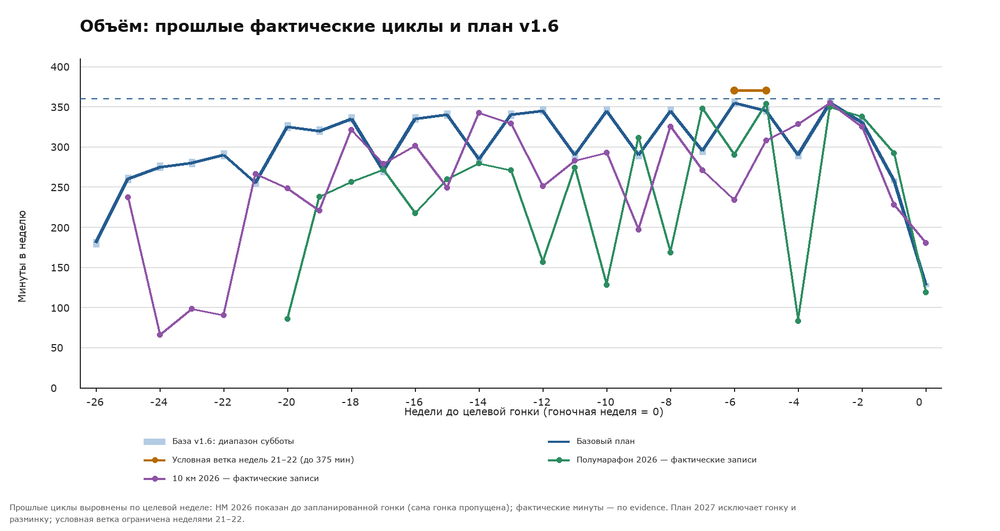

# Полумарафон 4 апреля 2027 · программа подготовки

Версия 1.6 · 5 октября 2026. Цель — лучший реализуемый результат на полумарафоне с уверенным прохождением дистанции. Основа — два отчёта за 2025–2026 годы и твои текущие ограничения и предпочтения.

## Предлагаемый подход

**27 календарных недель: восстановление после 10 км, постепенное развитие аэробного объёма, затем девять недель специфической работы и двухнедельная подводка.** Пять беговых дней по календарю: обычно понедельник, среда, пятница, суббота и воскресенье; в недели с воскресным H или субботним контролем четверг заменяет пятницу лёгким E. Во вторник отдых. Две содержательные работы — максимум, не квота; во многих базовых неделях пятница — E+A или E. Силовая отдельно не добавлена: выбран более низкий базовый беговой пик. Вес сам по себе не доказывает причинную связь с риском и не задаёт норму силовой нагрузки.

Базовый объём растёт постепенно: длительная недели 3–5 — 75→80→85 минут; после разгрузки недели 6 (70 минут) — 90→95→100 минут в недели 7–9. T увеличивается с 10 до 12 и затем 18 рабочих минут к неделе 5; недели 7–9 удерживают 18 минут T, а понедельник добавляет лёгкое время. В неделях 4–5 одновременно растут T и длительная — осознанный компромисс; дальнейший рост требует контролируемой работы, проверки фактической дистанции относительно самого длинного бега за предыдущие 30 дней и нормального восстановления. Базовый недельный пик — 360 минут, выбранный как осторожное плановое ограничение с учётом фактических максимумов прошлых циклов, не физиологический потолок. После проверки восстановления после недели 19 можно условно добавить только лёгкие минуты в недели 21–22; необязательная ветка достигает 375 минут и никогда не активируется автоматически. Длительная ограничена меньшим из указанного времени, 21 км и дистанции допустимой по скользящим 30 дням.

Это конкретный стартовый план, который пересматривается на границах циклов. Минуты дальних недель обозначают допустимый сценарий при нормальном выполнении предыдущих. Цель не требует добежать весь календарь любой ценой.

**Критерии перехода.** Следующую запланированную ступень выполняй, если все назначенные качественные части прошли контролируемо, E остаётся разговорным, длительная выдержана по усилию и правилу дистанции за последние 30 дней, обычная тяжесть проходит за 48 часов, нет новой боли или болезни. Разгрузочные и контрольные недели остаются лёгкими и не обязаны достигать рабочего объёма. При невосстановлении повтори предыдущую ступень или снизь минуты на 10–15%, не переноси и не компенсируй пропуски.

**Понедельники и восстановление.** E-понедельники назначены в неделях 3–5, 7–9, 11–12, 14–15, 17, 19, 21–22 и 24; остальные плановые понедельники — R, перечислены по дням в календаре. E выполняется по полным предложениям и RPE 2–3; при усталости сократить или отдохнуть без компенсации. После воскресных H недель следующий понедельник остаётся R. В базовой версии недели 17, 19, 22 и 24 часть лёгких минут смещена с четверга на понедельник; четверг перед ключевыми выходными — короткий лёгкий бег 50–55 минут. Условная ветка меняет только лёгкие минуты в неделях 21–22.

**Изменение версии 1.6:** после v1.5 T в неделях 3–5 наращивается до 3×6 минут (18 рабочих минут); длительные недель 7–9 составляют 90/95/100 минут, а T удерживается на 3×6. В недели 7–9 добавлено лёгкое время по понедельникам. Одновременный рост T и длительной в неделях 4–5 — осознанный компромисс; каждое увеличение длительной всё равно зависит от фактической дистанции за предыдущие 30 дней и восстановления. Условная ветка ограничена неделями 21–22 и 375 минутами; неделя 24 остаётся базовой.

**Исходные данные и коррекция длительных:** по плану 10 км длинные 6, 13 и 20 сентября были 80, 80 и 70 минут; Garmin зафиксировал 80,0 мин / 12,7 км, 80,7 мин / 13,0 км и 70,1 мин / 11,4 км. Эти данные подтверждают недавнее выполнение около 80 минут, но не 90/85 минут. Поэтому план задаёт постепенный возврат длительных 75→80→85, после разгрузки 70 — 90→95→100 только с обязательной проверкой фактической дистанции относительно самого длинного бега за предыдущие 30 дней и восстановления.

Рассмотрены три варианта:

| Подход | Что он даёт | Оценка для тебя |
|---|---|---|
| **Большая доля лёгкого бега, две контролируемые работы, постепенный переход к специфике** | Развивает объём и способность держать длительное усилие; сохраняет немного быстрых интервалов | **Выбран.** Учитывает полумарафонскую цель и позволяет управлять субботой и воскресеньем |
| Преимущественно поляризованная подготовка | Лёгкий бег и короткие интенсивные занятия, меньше средней интенсивности | Может работать; сейчас менее удобна как основной способ включить длинные полумарафонские блоки |
| Концентрированные блоки интенсивной работы | На время усиливает один тренировочный стимул | Требует особенно точного управления восстановлением; по твоим записям пока нет основания предпочесть его |

По современному метаанализу нет универсального преимущества поляризованного распределения над пирамидальным. Выбор здесь — индивидуальное решение по твоей истории, а не объявление единственной научно правильной системы. [Rosenblat et al., 2025](https://pubmed.ncbi.nlm.nih.gov/39888556/).

## Что изменено с учётом двух прошлых циклов

| Наблюдение из отчётов | Решение в программе |
|---|---|
| Весной уже были 18–20 км и 19 км с 2×4 км; последние длительные перед сентябрьскими 10 км — 11,4–13,0 км по Garmin | Вернуться к большой длительной постепенно. Зимние 20 км не считаются текущим привычным объёмом |
| Фактический максимум в 10-км цикле — 355 мин/нед.; в полумарафонском цикле 2026 — 353,45 мин и 53,92 км (неделя 9–15 февраля), рядом 347,23 и 349,34 мин | Базовый план ограничен 360 мин по осторожному плановому выбору, не физиологическому потолку; условная ветка до 375 мин на неделях 21–22 только по критериям восстановления |
| Максимум 56,6 км в плане 2026 — именно плановый километраж, а не фактический объём в минутах | Не приравнивать запланированный километраж к выполненным неделям; ориентироваться на записанные фактические тренировки |
| В феврале были 8 км интервальной работы в среду и 8 км быстрой непрерывной работы в четверг | Развести работы: обычно среда и пятница, между ними отдых. В специфические недели — среда и воскресенье, четверг Z2, пятница отдых |
| В цикле 10 км иногда спокойно переносились две работы, но это не обязательная норма каждой недели | В версии 1.6 две содержательные работы — максимум, а в неделях с новым пиком длительной пятница становится лёгкой |
| Некоторые parkrun с названием light фактически были быстрыми | Большинство суббот — Z2. Три заранее выделенных контроля заменяют другую интенсивность недели |
| В ряде интервальных работ последние повторы замедлялись | Первый повтор сдержанный; сохраняем объём основной части, только если последние повторы контролируемы |
| Были болезни и недели резкого снижения объёма | Пропуски не компенсируем. Возвращение определяется самочувствием и фактически выполненной нагрузкой |
| На финальных 10 км было замедление в конце, при этом трасса имела мосты | Уделяем внимание устойчивому усилию и питанию на длительных; не приписываем всё замедление одному фактору |

Источники: [полумарафонский отчёт](../half_marathon_2026/training_report.md), [отчёт о 10 км](../10k_2026/training_report.md). Полная программа по дням — в [календаре](weekly_plan.md).

## Циклы

| Цикл | Даты | Недели | Основная работа | Полный недельный объём |
|---|---|---:|---|---|
| Восстановление | 28.09–11.10 | 1–2 | Лёгкий бег по самочувствию; возвращение к пяти дням | Первая неделя необязательная; вторая примерно 255–265 мин |
| Аэробная база I | 12.10–08.11 | 3–6 | Длительные 75–80–85 мин, затем разгрузка 70 мин; T до 3×6 мин к неделе 5 | 270–295 мин на неделях 3–5; неделя 6 — 250–260 мин |
| Аэробная база II | 09.11–06.12 | 7–10 | Длительные 90–95–100 мин, T 3×6 мин удерживается; контроль parkrun на неделе 10 | 315–345 мин на неделях 7–9; контрольная неделя — 265–275 мин |
| Развитие выносливости | 07.12–17.01 | 11–16 | До 24 минут T в среду; пятница S умеренная или E+A по календарю | Рабочие недели до 350 мин; разгрузки 280–290 и 285–295 мин |
| Специфика I | 18.01–14.02 | 17–20 | H-блоки 3×8 и 2×15 мин; короткая среда | Рабочие недели до 350 мин; контроль/разгрузка 285–300 мин |
| Специфика II | 15.02–21.03 | 21–25 | Длительные 120–125 мин, H 2×20 мин на неделях 22 и 24 | База до 360 мин; условная ветка недель 21–22 до 375 мин после проверки |
| Подводка | 22.03–04.04 | 26–27 | Сокращение минут, короткие знакомые блоки, старт | Неделя 26 — 255–260 мин; неделя 27 — 125–130 мин до гонки |

Чередование нагрузки и разгрузок в таблице — практическая организация, а не доказанная оптимальная схема «3+1 для всех». При усталости разгрузка переносится раньше. В развитие выносливости заложены облегчения 21–27 декабря и 11–17 января. Дополнительный рост объёма заранее не назначается и не компенсирует пропуски.

## Как читать зоны

Пользователь подтвердил актуальные проценты **Garmin RUNNING %LTHR** 29 сентября. Свежие настройки Garmin получены 5 октября: LTHR 174 уд/мин, ЧСС покоя 43, максимум 192; границы зон по пульсу — Z1 113–138, Z2 139–154, Z3 155–164, Z4 165–173, Z5 от 174. Целочисленная граница Z5=174 отражает округление интерфейса Garmin при пороге 174, а не отдельный запас над порогом. Последняя сама оценка LTHR и скорости остаётся датированной 5 августа; настройка зон не обновляет физиологическую оценку.

[Свежий снимок Garmin от 5 октября](data/garmin_snapshot_2026-10-05.json) и [снимок настроек от 29 сентября](data/garmin_snapshot_2026-09-29.json) сохранены отдельно. Последний остаётся историей до обновления границ. Никакое значение ниже не является лабораторной оценкой или медицинским лимитом.

Зоны — справочная рамка для анализа, не цель тренировки. E: RPE 2–3, свободные полные предложения. 148–150 уд/мин — временный личный сигнал проверить/замедлить, не жёсткий потолок; не нужно держать минимум 139, а при провале теста разговора следует замедлиться. S: RPE 3–4, ниже T, в Z2 или нижней части Z3 по ощущениям; не форсировать 155. T: контролируемая RPE 6–7; не стремиться к 165–174. H: контролируемая RPE 5–6, сверять одинаковые блоки, дыхание и восстановление; предсказанный темп гонки не задаёт темп H.

| Код | Пульсовая справка Garmin | Предписание по усилию | Применение |
|---|---:|---|---|
| R | Z1 (113–138), иногда низ Z2 | RPE 1–2, очень лёгкий свободный разговор | Восстановление |
| E | Z2 (139–154), начало/конец в Z1 | RPE 2–3, полные предложения; talk test важнее ЧСС | Лёгкий бег и длительные |
| S | Обычно Z2 / низ Z3 (139–159 ориентировочно) | RPE 3–4, умеренно, ниже порога; не форсировать 155 | Умеренные аэробные фрагменты |
| T | Зона только для контекста | RPE 6–7, короткие фразы, контролируемо | Пороговые отрезки без гона за границей |
| H | Верх Z3 / низ Z4 только как контекст | RPE 5–6, устойчивые блоки и нормальное восстановление | Специфическая работа |
| A | Нет | Коротко и расслабленно, полный отдых между ускорениями | Ускорения, не отдельная качественная работа |

Оценку LTHR пересмотреть около контроля 5 декабря по свежей оценке Garmin и реакции на тренировки. Результат контрольного 5 км сам по себе не измеряет LTHR.

## Обычная неделя и выходные

| День | Базовая неделя по календарю | Неделя с H-длительной или контролем |
|---|---|---|
| Понедельник | E 40–60 минут в E-недели или R по календарю | E или короткий R по календарю |
| Вторник | Отдых | Отдых |
| Среда | Единственная главная рабочая часть, обычно T; разгрузка короче | Короткая контролируемая T |
| Четверг | Обычно отдых | E 40–60 минут на H/контрольных неделях по расписанию |
| Пятница | E, E+A либо умеренная S, обычно 40–50 минут всего | Отдых |
| Суббота | Parkrun 5 км E плюс дорога Z1 | Parkrun 5 км E плюс дорога Z1 |
| Воскресенье | Длительная E | Длительная с блоками H |

A — короткие расслабленные ускорения, они не считаются второй работой. На неделях с новой максимальной длительной пятница — E+A, чтобы убрать плотное соседство; H переносится на воскресенье только в предусмотренных специфических неделях. Количество содержательных работ — максимум две, во многих неделях одна; не нужно выполнять все опции при усталости.

Пять пробежек — основной формат. Если после длительной понедельник не помогает восстановиться, сократить E до 35–45 минут или сделать R/отдых; эту пробежку не переносить на вторник перед средой и не компенсировать позже. Если к пятнице не восстановился после среды, заменить работу E или отдыхом. При тяжёлых ногах в специфическую неделю сократить четверг до 40–60 минут E. Потерянную работу не переносить на субботу и не добавлять к воскресенью.

**Контрольные parkrun: 5 декабря, 30 января, 6 марта.** Это выбор суббот, а не гарантия проведения события. При отмене, гололёде или плохом самочувствии контроль отменяется либо переносится вместе с облегчённой неделей. Не сравнивать результаты на несопоставимом покрытии как чистый прирост формы.

В контрольные недели (10, 18, 23) среда — короткая контролируемая T, 2×6 минут; четверг E, пятница отдых. Вторая работа — субботний контроль. Если к среде сохраняется усталость, её заменить E. Воскресенье — до 75 минут легко, при усталости 45–60 минут. В остальные субботы не добавлять соревновательный финиш. Если всё же пробежал parkrun тяжело, воскресные блоки H отменяются, а длительная становится короткой лёгкой пробежкой.

Суббота 3 апреля — особая: при свежих ногах можно пройти привычный parkrun очень легко бегом, но добраться туда и обратно **пешком**, чтобы не получить часовую пробежку накануне старта. При тяжести в ногах — 15–20 минут у дома или отдых, на событии можно присутствовать без бега.

## Разминка, заминка и учёт времени

Твои **15 минут лёгкого бега до парка и 15 минут домой подходят как стандарт**; не нужно специально удерживать пульс в нижней зоне. Для лёгкой пробежки дополнительных ускорений не нужно. Перед T после лёгкого подхода добавь 3–4 ускорения по 15 секунд с 60–75 секундами лёгкого бега; перед контрольным parkrun — такую же короткую активацию. A в пятничных E+A — это отдельные 4×12 секунд расслабленно, по желанию; не путать с качественной работой.

В сильный холод, при скованности или перед быстрой работой разминку можно увеличить до 20 минут и сократить лёгкое заполнение основной части. Если скованность не проходит, заменить работу на лёгкий бег. Длительный перерыв стоя между подходом к парку и стартом parkrun охлаждает мышцы: несколько минут лёгкого движения перед стартом полезнее дополнительного быстрого километра.

**Полное время уже включает всё.** Пример среды 65 минут: 15 минут Z1 + 5 минут активации + 3×8 минут T с двумя восстановительными промежутками по 2 минуты + 2 минуты легко + 15 минут Z1 = 65 минут. Для спокойного четверга 75 минут: 15 Z1 + 45 Z2 + 15 Z1.

Для длительной первые и последние 15 минут тоже входят в общий лимит. Длительная 125 минут с 2×20 H: 30 легко + 20 H + 5 легко + 20 H + 35 легко + 15 Z1. Никаких дополнительных километров поверх этого задания не требуется.

Универсальной доказанной минимальной разминки именно для тебя нет. Это практическая схема, согласующаяся с обзорными данными о пользе активной разминки для выполнения работы. [Fradkin et al., 2010](https://pubmed.ncbi.nlm.nih.gov/19996770/).

## Условия увеличения нагрузки

В следующую рабочую неделю переходить, если предыдущие занятия выполнены без нарастающей боли, сон и самочувствие обычные, а лёгкие пробежки ощущаются лёгкими. После качественной работы должен оставаться запас на нормальное продолжение недели. Если два занятия подряд неожиданно тяжелее обычного, повторить более лёгкую неделю либо убрать 15–25% минут и качественную часть. Эти проценты — практический вариант снижения, не диагностическая формула.

За один шаг увеличиваем прежде всего **продолжительность**, либо **рабочую часть**, либо **интенсивность**. Новая длинная работа H вводится с сокращённой средой. Полного запрета сочетать два стимула нет, но после истории двух тяжёлых дней подряд здесь специально оставлен запас.

**Длительная ограничена меньшим из назначенных минут и 21 км.** В версии 1.6 длительная достигает 100 минут в ноябре (неделя 9) при нормальном восстановлении; рабочий максимум — 125 минут. Если дистанция одной пробежки заметно выходит за самый длинный бег последних 30 дней, сократить её, даже когда минуты формально совпали с планом. При превышении примерно на 10% или больше сначала удержать прежнюю дистанцию и пересмотреть прибавку. Это осторожный рабочий сигнал из наблюдательных данных, а не доказанная граница безопасности. [Frandsen et al., 2025](https://pubmed.ncbi.nlm.nih.gov/40623829/).

При пропуске одного занятия продолжить календарь, ничего не «возмещая». После нескольких дней болезни или выраженной усталости начать с коротких лёгких пробежек; интенсивность вернуть после нормальной реакции на них. При температуре или системных симптомах бег пропускается. Боль, которая меняет шаг или усиливается по ходу бега, требует прекращения занятия и оценки причины. Это отличается от описанной тобой обычной мышечной крепатуры после 10 км; первые дни сейчас всё равно остаются восстановительными.

В гололёд T, быстрые ускорения и контрольный parkrun заменить E. Плохое сцепление не компенсировать усилием. При наличии безопасной дорожки допустима замена по времени и ощущению; зимний темп не требуется сохранять любой ценой.

## Контрольные точки и выбор гоночного усилия

| Когда | Что оценить | Решение |
|---|---|---|
| 11 октября | Ушла ли крепатура, обычен ли лёгкий бег | Начать базу или продлить восстановление |
| 8 ноября | Переносимость пяти дней, длительных до 85 минут и разгрузки | Увеличивать лёгкий объём или повторить блок |
| 5–6 декабря | Контроль 5 км, стабильность последних недель | Уточнить рабочее усилие T и общий объём |
| 17 января | Переносимость назначенных качественных частей и длительной до 110 минут | Переходить к H только при устойчивом выполнении |
| 30–31 января | Контроль 5 км и восстановление после него | Уточнить форму; не превращать прогноз с 5 км в готовый темп полумарафона |
| 6–14 марта | Контроль 5 км и последняя большая специфическая работа | Выбрать реалистичное стартовое усилие и ориентир результата |
| 22 марта | Накопленная усталость, выполнение последних недель | При необходимости сделать подводку легче |

В H-сессиях сравнивать скорость одинаковых блоков, субъективное усилие, дыхание и качество завершения. Одинаковая скорость при резко растущей тяжести не считается автоматически удачным контролем. Заданный или прогнозный темп около 5:18/км не заменяет проверку усилия и восстановления. На другом покрытии или при другой погоде прямое сравнение ограничено.

Сентябрьские 50:45 на 10 км — полезная текущая отправная точка, но точного целевого времени на апрель из них не назначаю. Оно будет зависеть от зимней подготовки и мартовских контрольных точек. В сам день полумарафона начальные 3–5 км — сдержанно, около привычного усилия H или чуть легче; затем устойчивое усилие, и только после 15–17 км при сохранённом контроле можно повышать его. Рост ЧСС к концу возможен: не пытаться насильно удержать одну зону все 21,1 км и не ускоряться только ради выхода в более высокую зону.

## Питание и подводка

На длительных от 90 минут постепенно отработать переносимое питание и питьё. Практический старт — около 30 г углеводов в час, затем при хорошей переносимости приблизиться к 45–60 г/ч на специфических работах. Проверять это на тренировках, включая упаковку и приём на бегу; выбирать знакомый вариант на гонке. Пить по жажде с учётом условий, не задавать одинаковые литры на холодную и тёплую погоду. Основание диапазона углеводов — рекомендации для продолжительной работы, индивидуальная переносимость остаётся обязательным условием. [Burke et al., 2011](https://pubmed.ncbi.nlm.nih.gov/21660838/).

В целевом блоке H растёт 24 → 30 → 40 минут и достигает 40 минут на неделе 22; неделя 24 повторяет тот же объём 2×20. В прошлой подготовке к полумарафону были 2×4 км примерно на 45,5 минуты работы. Сходство есть только по длительности: оно не подтверждает равную интенсивность или лёгкую переносимость H. Прогноз 50:45 даёт темп около 5:18/км, но это не назначение темпа H; его следует оценивать по усилию и восстановлению.

Последняя большая специфическая длительная — **14 марта**, за три недели до старта. 21 марта — 105 минут легко. Затем 70 минут 28 марта с необязательной короткой вставкой H или полностью легко. За последние две недели тренировочные минуты в среднем сокращаются примерно наполовину относительно полных рабочих недель, при сохранении коротких знакомых интенсивных фрагментов. Гонка и её разминка не включены в расчёт снижения.

Метаанализы поддерживают снижение объёма с сохранением интенсивности коротких отрезков и по возможности частоты. Это не предписание делать тяжёлую тренировку при накопленном утомлении. Конкретные 27 недель, длительные до 125 минут и места разгрузок являются индивидуальным проектным решением, не результатом прямого исследования именно такого календаря. [Bosquet et al., 2007](https://pubmed.ncbi.nlm.nih.gov/17762369/), [Wang et al., 2023](https://pubmed.ncbi.nlm.nih.gov/37163550/).

## Минимальная запись после тренировки

Достаточно сохранить фактическую длительность, дистанцию, вид работы, субъективную тяжесть 0–10 и одну фразу о самочувствии или причине изменения. После H и контроля parkrun добавить реакцию на следующий день. Это заполнит главный пробел прошлых отчётов: там хорошо видна внешняя нагрузка, но не всегда понятно, как ты её переносил.

Следующие материалы: [календарь всех 27 недель](weekly_plan.md), [исследования и границы выводов](research.md), [структурированные данные плана](data/plan.json).
